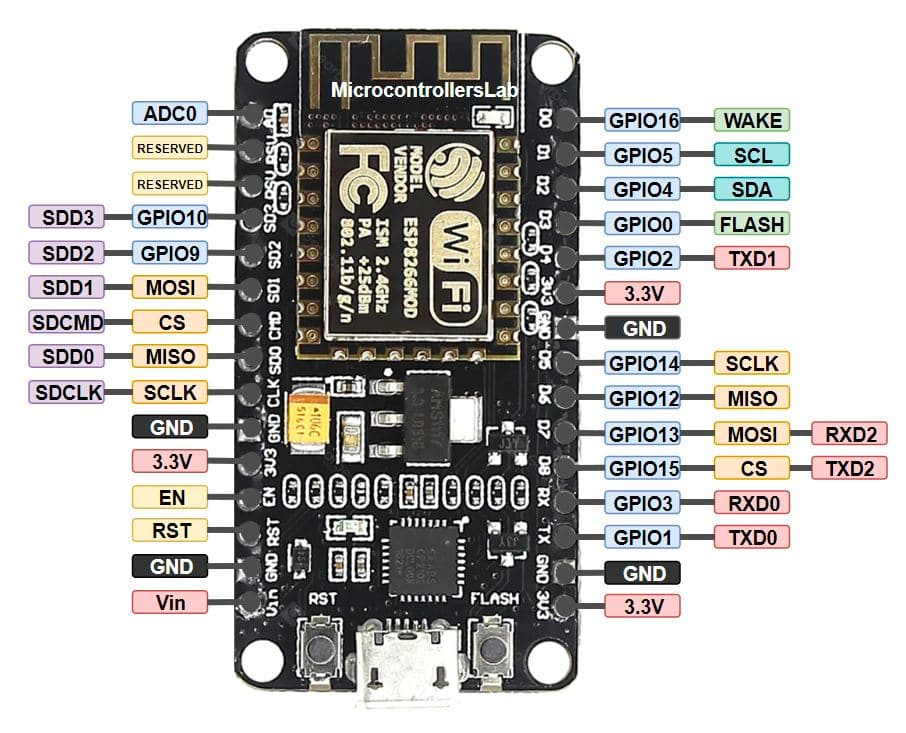
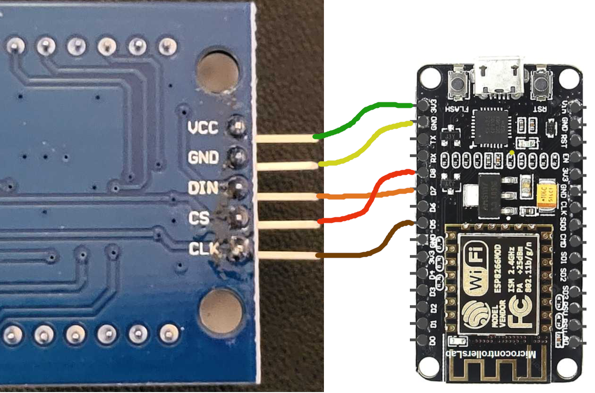
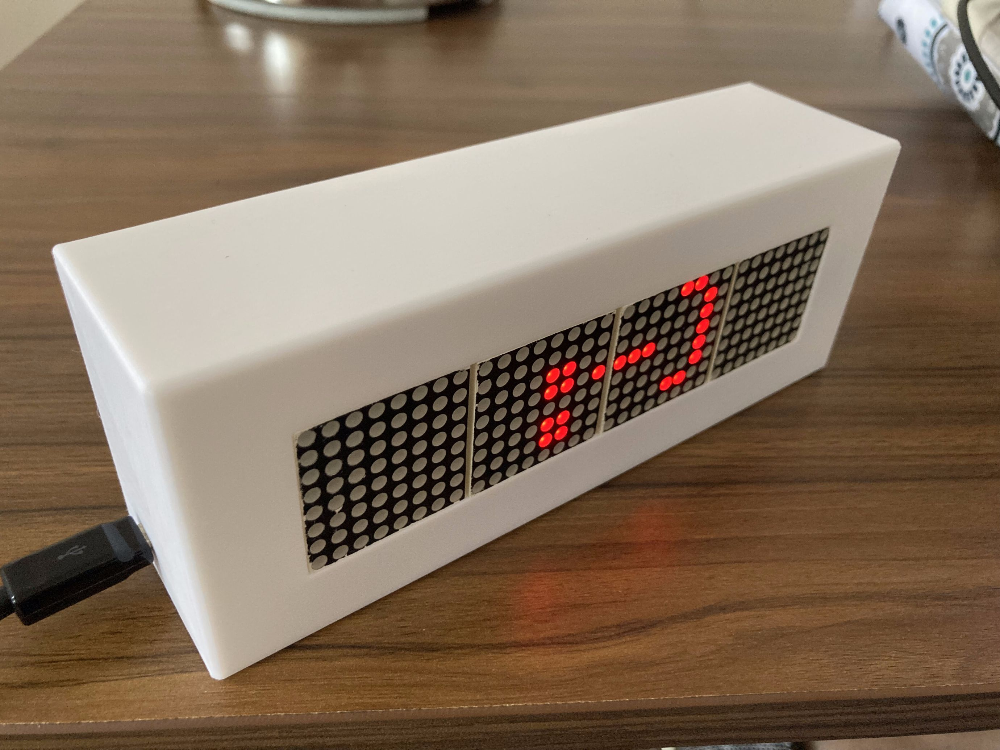
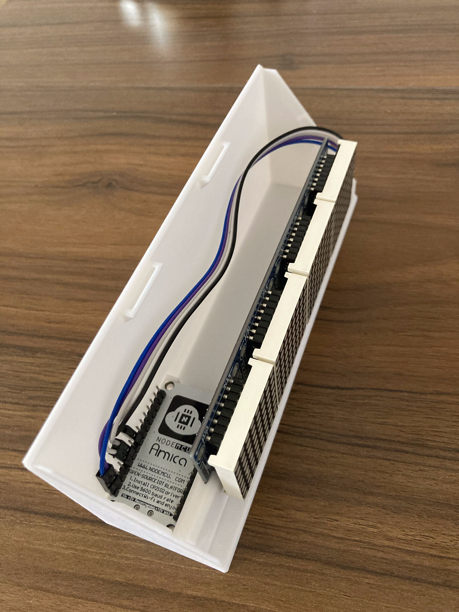

# Things you will need

## Hardware
-   A laptop
-   An [ESP8266 dev kit (Amica NodeMCU)](https://www.amazon.com/gp/product/B09J94LQ67/ref=ppx_yo_dt_b_asin_title_o04_s00?ie=UTF8&th=1 "https://www.amazon.com/gp/product/B09J94LQ67/ref=ppx_yo_dt_b_asin_title_o04_s00?ie=UTF8&th=1")
-   A USB micro-B cable that can plug into your laptop
-   A [MAX7219 8x32 dot matrix display module](https://www.amazon.com/gp/product/B07KQ31FX6/ref=ppx_yo_dt_b_asin_title_o04_s00?ie=UTF8&psc=1 "https://www.amazon.com/gp/product/B07KQ31FX6/ref=ppx_yo_dt_b_asin_title_o04_s00?ie=UTF8&psc=1")
-   5 female-female jumper wires

## Software
-   [VS Code](https://code.visualstudio.com/ "https://code.visualstudio.com/"
-   [PlatformIO VS Code extension](https://platformio.org/install/ide?install=vscode "https://platformio.org/install/ide?install=vscode")

---

# A little electronics knowledge
## Ohm's Law
-   Voltage = Current * Resistance
-   V = IR

## A word on safety
-   These electronics operate at low voltages (5V or 3.3V) and currents (< 1A)
-   They will not shock you
-   You might shock them!
    -   Be careful of short circuiting exposed pins
        -   i.e. keep away from metal, keep pins from touching each other
        -   I = V / R
        -   when R = 0, I = infinite
    -   Be careful of [electrostatic discharge](http://esdsystems.descoindustries.com/training/static-II.htm "http://esdsystems.descoindustries.com/training/static-II.htm")

---

# What is a microcontroller?
And how is it different from the computers you're used to?
-   Basically a little computer that only runs 1 program
-   Tiny - can embed in almost anything
-   Power efficient - can run on a battery
-   Essentially instantaneous boot time
-   You can interact with the physical world! 😎
    -   Lights, motors, switches, sensors, etc
-   You have to deal with the physical world 🙁
-   Debugging can be difficult
    -   Have to debug hardware as well as software
        -   Connection issues
    -   No stack traces
    -   No debugger
-   You can actually run out of memory, and you need to worry about this
-   Much easier to run into performance issues

# ESP8266 microcontroller
-   CPU
-   Memory
    -   RAM - volatile
    -   Flash, EEPROM - non-volatile
-   Input/Output
    -   17 GPIO pins
    -   SPI, I2C, I2S, UART
    -   10-bit ADC (Analog to Digital Converter)
-   IEEE 802.11 b/g/n Wi-Fi

## ESP8266 Dev Kit


Anatomy:
-   ESP8266 microcontroller module
-   Power regulator
-   USB chip and connector
-   Reset button
-   Flash programming button
-   GPIO (General Purpose Input/Output) pins
-   we will be using pins:
    -   GPIO14
    -   GPIO13
    -   GPIO15
    -   GND
    -   3.3V

---

# Firmware
-   The software that runs on a microcontroller
-   Needs to be installed ('flashed') into the non-volatile flash memory of the microcontroller

## Arduino
-   Popular microcontroller software development platform
-   Originally made for AVR microcontrollers, but has been ported to other chips, including ESP8266
-   C++ library

Anatomy of an Arduino program:
-   `void setup()` - runs once on startup
-   `void loop()` - runs continuously after setup()

---

# Blink
The 'Hello world' of embedded microcontroller programming

## Code
-   Create new PlatformIO project
    -   Name: Blinky
    -   Board: NodeMCU 1.0 (ESP-12E Module)
    -   Framework: Arduino

```
#include <Arduino.h>

void setup() {
  // put your setup code here, to run once:
  pinMode(LED_BUILTIN, OUTPUT);
}

void loop() {
  // put your main code here, to run repeatedly:
  digitalWrite(LED_BUILTIN, HIGH);
  delay(200);
  digitalWrite(LED_BUILTIN, LOW);
  delay(200);
}
```

-   `pinMode(pin, mode)`    
-   `digitalWrite(pin, value)`
-   `delay(msec)`

## Connect
-   Connect ESP8266 to computer via USB cable (& adapter)
    -   USB cable used for communication and power
-   Build firmware
-   Upload firmware
-   Reset button

## Serial debug

```
#include <Arduino.h>

void setup() {
  // put your setup code here, to run once:
  Serial.begin(9600);
  Serial.println("Hello");
  
  pinMode(LED_BUILTIN, OUTPUT);
}

void loop() {
  // put your main code here, to run repeatedly:
  Serial.println("On!");
  digitalWrite(LED_BUILTIN, HIGH);

  delay(200);

  Serial.println("Off.");
  digitalWrite(LED_BUILTIN, LOW);
  
  delay(200);
}
```

-   `Serial.begin(baud_rate)`   
-   `Serial.printf()`
-   Serial Monitor

---

# MAX7219 matrix display
-   The [MAX7219](https://datasheets.maximintegrated.com/en/ds/MAX7219-MAX7221.pdf "https://datasheets.maximintegrated.com/en/ds/MAX7219-MAX7221.pdf") is an IC made for controlling 8 digit, 8 segment LED displays
-   Can also be used to control 8x8 LED [matrix displays](https://www.circuitspecialists.com/blog/getting-started-with-an-led-matrix-tutorial/ "https://www.circuitspecialists.com/blog/getting-started-with-an-led-matrix-tutorial/")
-   Controlled via 3 pin SPI interface
-   Can be daisy chained

## Connect Matrix display to ESP8266 dev board
```
                        MAX7219 
         4 8x8 LED matrix modules = 32x8 matrix
		 
        <-OUT                                IN<-                  ESP8266
                                                                Amica NodeMCU
      [r0, c31]    24       16       8     [r0, c0]
 bit  row +--------+--------+--------+--------+   pin         pin
   0   0  |        |        |        |        |  label       label
   2   1  |        |        |        |        | - CLK   <->    D5  GPIO14  HSCLK
   4   2  |        |        |        |        | - CS    <->    D8  GPIO15  HCS
   8   3  |    3   |    2   |    1   |    0   | - DIN   <->    D7  GPIO13  HMOSI
  16   4  |        |        |        |        | - GND   <->   GND 
  32   5  |        |        |        |        | - VCC   <->   3V3 
  64   6  |        |        |        |        |
 128   7  |        |        |        |        |
          +--------+--------+--------+--------+
      [r7, c31]    24       16       8     [r7, c0]
```



## Code
-   Install [MD_MAX72XX](https://majicdesigns.github.io/MD_MAX72XX/index.html "https://majicdesigns.github.io/MD_MAX72XX/index.html") library
```
MD_MAX72XX matrix(
    MD_MAX72XX::FC16_HW,
    15, // CS
    4   // # of devices
);
```
-   `matrix.begin()`
-   `matrix.clear()`
-   `matrix.setPoint(row, column, state)`
-   `matrix.setColumn(column, value)`
    -   `uint8_t` - 8 bits, 0 to 255

---

# TINT Matrix
-   [Factual/tint-matrix](https://github.com/factual/tint-matrix)

## Try it
-   Build firmware
-   Upload firmware
-   Upload filesystem image
    -   `PlatformIO` -> `Project Tasks` -> `nodemcuv2` -> `Platform` -> `Upload Filesystem Image`

### Initial setup
-   Matrix should display `setup`
-   Open Serial Monitor
-   Connect to `TINT Matrix` wifi network with your phone
-   TINT Matrix captive portal wifi settings page will appear
-   Enter your wifi settings and submit

### Normal operation
-   Matrix should display `-> wifi` and it will attempt to connect to your wifi network
-   When it connects, the matrix will display its IP address
-   Open the IP address of the matrix in a browser
-   Enter some text and see it show up on the matrix!
-   Disconnect from computer, power with e.g. USB battery

## Code anatomy
### setup()
-   `server.serveStatic("/", LittleFS, "/web/app/")`
    -   `data` directory
-   `server.on(url, callback)`
    -   `req->hasParam()`
    -   `req->getParam()`
    -   `req->send()`
    -   `req->redirect()`

### loop()
-   `matrix.update(state)`
-   `delay(loop_delay)`

## Testing firmware
-   Put tests in `test` dir
-   Run `PlatformIO: Test` command

## Updating web application code
-   Put web application code in `data/www/app`

---

# 3D Printed Enclosure





Here are files to 3D print an enclosure for the LED matrix:
-   cover.3mf
-   base.3mf
